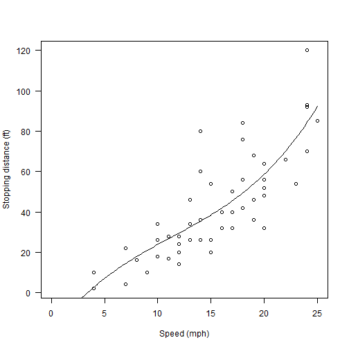

## Car Stopping Distance Calculator

Hi, This is my first Shiny app and I am really excited to pitch it to the audience. It's a Car stopping distance calculator which calculates the distance after which a car stops (in feet) given it's speed in Miles per hour.


--- .class #id 

## The Background work of the app
- The app fits a cubic ploynomial to the cars dataset in R and uses this fitted model to make predictions. 

-The decision to use cubic fit was arrived at after intensive experimentation with various different curve fits.

-The app is very useful as it can predict when a car will stop given the speed it is going at. This if deployed in cars along with distance to an obstacle ahead can help drivers decide when to use the brakes so as to avoid collisions.

--- .class #id 

## R Code
The following R code was used to fit the data and make predictions. A code snippet doing the calculations is demonstarted.


```r
  library(datasets)
  SpeedOfCar<-43
  fm <- lm(dist ~ poly(speed, 3), data = cars)
  StopDist <- predict(fm, data.frame(speed = SpeedOfCar))
  StopDist
```

```
##        1 
## 441.5348
```

--- .class #id 

## Plot of fit

```r
library(datasets)
plot(cars, xlab = "Speed (mph)", ylab = "Stopping distance (ft)",las = 1, xlim = c(0, 25))
  d <- seq(0, 25, length.out = 200)
  lines(d, predict(fm, data.frame(speed = d)))
```

 


